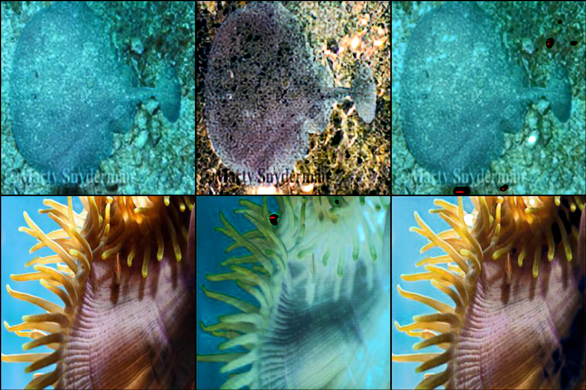
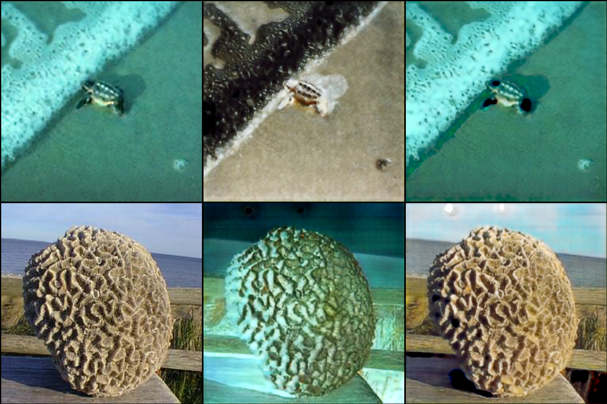
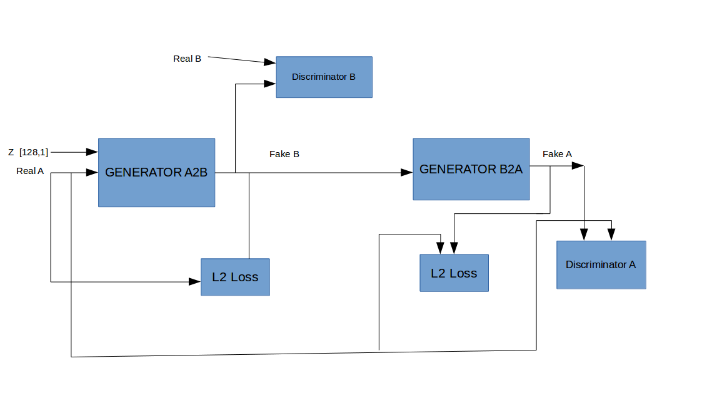

# Cycle Gan Experiments

## Network Architecture

### Generator 

### Discriminator

### Attention Layer

We use the attention layer proposed in [Self-Attention Generative Adversarial Networks](https://arxiv.org/pdf/1805.08318.pdf);
we add [spectral normalization](https://arxiv.org/pdf/1802.05957.pdf) after each convolution layer.
The attention layer has the following network.

### Cycle Gan Architectrure and Loss fucntion

Cycle Gan is used for domain transfer. We have two domains A and B (e.g: rainy images 
, no rain images). As shown in figure below, we have two generators; one to transform image in
domain A to image in domain B. Furthermore; we have two discriminators to compare generated
images to real images.

### Loss functions

Label for real images is 1.0 and 0.0 for fake images.
The two discriminators are trained using the following loss function; 
where MSE = mean square error.

--------

---
We train the network using the Adam optimizer with learning rate = 0.0002;
batch_size =1 and  image_size = 512x512

# Rainy to clear images:

Example of output images during training:
We use synthetic rainy images in our example;
we can find  real world rainy image in the following [link](https://drive.google.com/file/d/1Vh3T6XZ-2337vTwrnS7kvGTTiBronyqr/view?usp=sharing). 

We have respectively:

* RealA, fakeB, recA
* RealB, fakeA, recB
* Gaussian noise, RealA-fakeB, fakeA-RealB

# Gaussian denoising:

Example of output images during training:

We have respectively:

* RealA, fakeB, recA
* RealB, fakeA, recB

# Hazy to clear images:

We have respectively:

* RealA, fakeB, recA
* RealB, fakeA, recB

# Underwater to clear images:

# Face Sketch to images:

# Other approach

## Architecture

## Denoisng: Darmstadt Noise Dataset

### With data L2 loss similar to discriminator loss in importance

Real A, Fake B, Real B, fake A:

### With data L2 loss higher importance than discriminator loss

## Dehazing

### With data L2 loss similar to discriminator loss in importance

Real A, Fake B, Real B, fake A:

